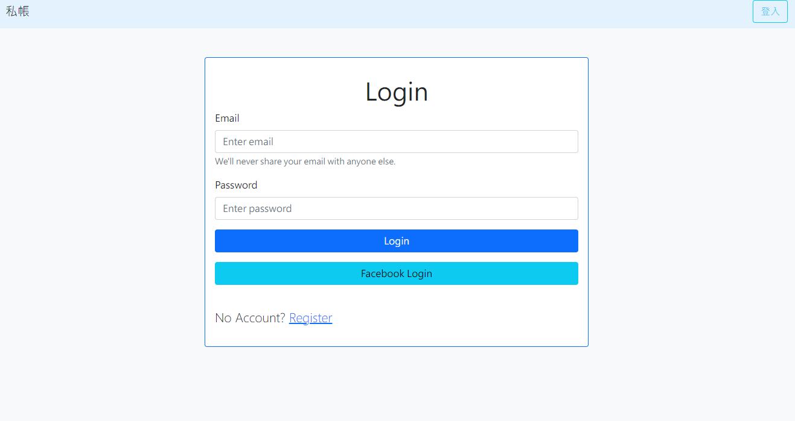
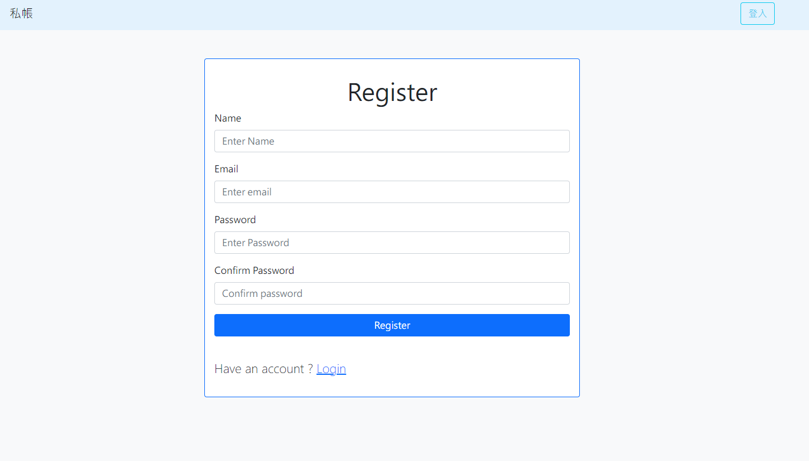
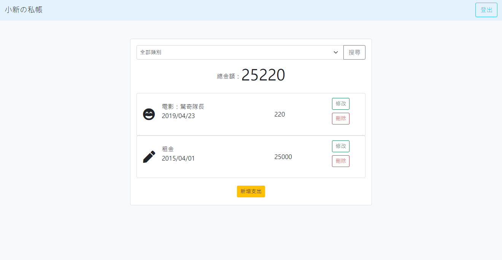
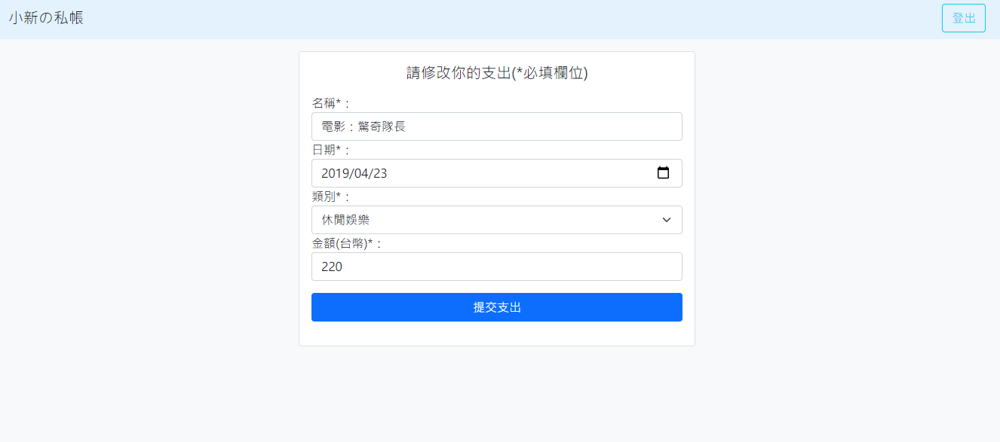
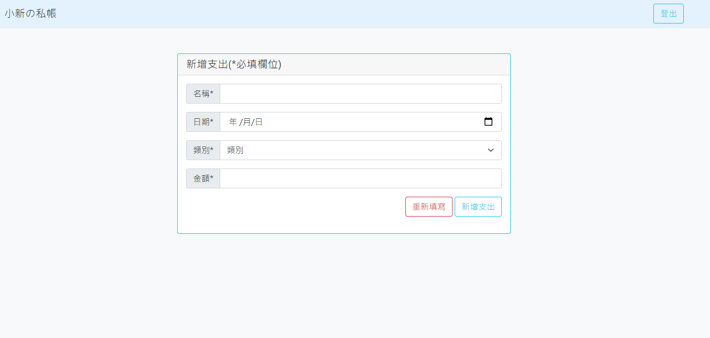

# Expense Tracker Application
A web app helps people for recording their daily expense.

## Screen Shot

### Login Page


### Register Page


### Index Page


### Edit Page 


### New Page


## Features
1.  Browse all expenses.
2.  Create expense.
3.  Delete expense.
4.  Facebook Login.
5.  Register and login.

## Requirement
1. Node.js (V14.16.0 recommended)
2. MongoDB (V4.2.17 recommended)

## Installation 
1. Open terminal, rub command below
```
git clone https://github.com/lcy101u/Expense-tracker.git
```

2. Change directory to expense-tracker
```
cd expense-tracker
```

3. Install modules
```
npm install
```

4. Create database and name it expense-tracker in MongoDB server

5. Generate Seed
```
npm run seed
```

6. Check localhost in your browser


